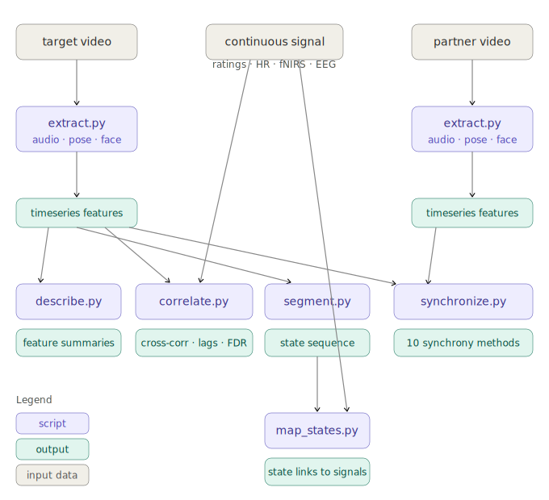

# SocialCurrents


Extract 400+ behavioral features from video recordings and analyze social dynamics - interpersonal synchrony, conversational states, and impression formation - with no manual annotation required.

SocialCurrents is a multimodal feature extraction and analysis toolkit for social and behavioral research. Given video recordings of conversations, it extracts time-stamped behavioral features covering body movement, facial expression, speech, and language. Its analysis tools then relate these features to dynamic trait ratings, multi-channel neural recordings (fNIRS, EEG, fMRI), or any external timeseries, using lagged cross-correlation, HMM segmentation, and 10 interpersonal synchrony methods from the psychophysiology literature.

## Table of contents

- [Pipeline overview](#pipeline-overview)
- [Requirements](#requirements)
- [Installation](#installation)
- [Quick start](#quick-start)
- [Usage](#usage)
- [Command reference](#command-reference)
- [Output format](#output-format)
- [Feature extractors](#feature-extractors)
- [Feature reference](#feature-reference)
- [Facial expression extraction (Py-Feat)](#facial-expression-extraction-py-feat)
- [Analysis toolkit](#analysis-toolkit)
- [Optional & heavy features](#optional--heavy-features)
- [Environment variables](#environment-variables)
- [Troubleshooting](#troubleshooting)
- [Roadmap](#roadmap)
- [References](#references)
- [Funding](#funding)
- [Citation](#citation)

**Extracted features** span four modalities: body movement (33 pose landmarks per frame), facial expression (action units, valence/arousal, emotion probabilities), speech (pitch, volume, spectral features, emotion recognition), and language (transcription with speaker diarization, sentiment, semantic similarity).

## Pipeline overview

The diagram below shows how SocialCurrents components relate to one another.



## Requirements

- macOS (Intel or Apple Silicon)
- [Conda](https://docs.conda.io/en/latest/miniconda.html) (Miniconda recommended)
- [Homebrew](https://brew.sh) (for ffmpeg)
- ~15 GB disk space for models and dependencies
- A free [HuggingFace](https://huggingface.co) account and token for speaker diarization (WhisperX)

**Note on Apple Silicon:** WhisperX transcription (and dependent NLP extractors) currently requires native x86 or GPU hardware. On Apple Silicon Macs running x86 conda environments under Rosetta, the transcription step will crash. Audio and vision extractors work normally. Full pipeline functionality including transcription is available on Linux servers or GPU-equipped machines.

## Installation

```bash
# 1. Clone the repo
git clone https://github.com/ohdanieldw/socialcurrents.git
cd socialcurrents

# 2. Run the one-time setup (creates a conda env, installs all dependencies)
bash setup_macos.sh
```

Setup takes 5-15 minutes on first run. It creates a conda environment called `pipeline-env` and installs all Python packages automatically.

For WhisperX speaker diarization, set your HuggingFace token (get one free at [huggingface.co/settings/tokens](https://huggingface.co/settings/tokens)):

```bash
export HF_TOKEN="hf_your_token_here"
```

Add this line to `~/.zshrc` or `~/.bash_profile` so it persists across sessions.

## Quick start

```bash
git clone https://github.com/ohdanieldw/socialcurrents.git
cd socialcurrents
bash setup_macos.sh
bash run_macos.sh -i data/dyad002_sub003.MP4 -o output/
```

## Usage

```bash
# Run on a folder of video files
bash run_macos.sh -i data/ -o output/

# Skip CPU-prohibitive extractors (recommended on CPU-only machines)
bash run_macos.sh -i data/ -o output/ --skip-slow

# Run only specific feature extractors (faster)
bash run_macos.sh -i data/ -o output/ -f basic_audio,mediapipe_pose_vision,pyfeat_vision

# Process a single video file
bash run_macos.sh -i data/dyad002_sub003.MP4 -o output/

# Reprocess files even if output already exists
bash run_macos.sh -i data/ -o output/ --overwrite

# Fix variable-frame-rate videos automatically (re-encodes to 25 fps)
bash run_macos.sh -i data/ -o output/ --normalize-fps

# Round CSV floats to 2 decimal places (default: 3)
bash run_macos.sh -i data/ -o output/ --decimal-places 2

# See all available extractors
bash run_macos.sh --list-features
```

**Variable frame rate videos** may cause errors. Use `--normalize-fps` to automatically re-encode to constant 25 fps before processing, or manually pre-process with `ffmpeg -i input.MP4 -vsync cfr -r 25 output.MP4`.

If an extractor fails (e.g., missing dependency, incompatible model), the pipeline logs a warning and skips that extractor rather than crashing. All other extractors continue running and output files are still generated.

### Common workflows

**"I want movement and facial data only"**
```bash
bash run_macos.sh -i data/ -f mediapipe_pose_vision,pyfeat_vision,emotieffnet_vision
```

**"I want speech and language features"**
```bash
bash run_macos.sh -i data/ -f basic_audio,librosa_spectral,whisperx_transcription,deberta_text,sbert_text
```

**"I want everything"**
```bash
bash run_macos.sh -i data/ -o output/
```

### Input filename convention

Name your video files using the pattern `{dyadID}_{subjectID}.extension`, e.g.:

```
dyad002_sub003.MP4
dyad002_sub007.MP4
dyad015_sub042.MP4
```

The pipeline splits on the first underscore to extract the dyad and subject IDs. If a filename does not contain an underscore, a single folder named after the file stem is created as a fallback.

### Supported input formats

| Type | Extensions |
|---|---|
| Video | `.mp4`, `.MP4`, `.avi`, `.mov`, `.MOV`, `.mkv` |
| Audio | `.wav`, `.mp3`, `.flac` (use `--is-audio`) |

## Command reference

All the flags you can pass to `run_macos.sh` (or `python extract.py`), explained in plain English:

| Flag | What it does |
|---|---|
| `-i data/` | **Which videos to process.** Point this at a folder of video files, or a single file. Default: `data/` |
| `-o output/` | **Where to save results.** Each subject gets their own subfolder inside this directory. Default: a timestamped folder under `output/` |
| `-f feat1,feat2,...` | **Pick specific analyses.** Instead of running all 35+ extractors, list only the ones you need (comma-separated, no spaces). Much faster when you only need a few. |
| `--skip-slow` | **Skip the slowest extractors.** Three extractors are too slow to run on a laptop without a GPU. This flag leaves them out. Has no effect when `-f` is used. |
| `--overwrite` | **Redo files that already have output.** By default, the pipeline skips videos that already have results in the output folder. Use this flag to reprocess them. |
| `--normalize-fps` | **Fix choppy or variable-speed videos.** Some cameras record at inconsistent frame rates, which causes errors. This flag re-encodes videos to a steady 25 frames per second before processing. |
| `--decimal-places 3` | **How many decimal places in the CSV.** Default is 3 (e.g., 0.142). Set to 2 for slightly smaller files, or 6 for maximum precision. |
| `--is-audio` | **Process audio files instead of video.** Use this when your input folder contains `.wav`, `.mp3`, or `.flac` files rather than video. |
| `--log-file run.log` | **Save a copy of the processing log.** In addition to the per-subject logs saved automatically, this saves a single log covering the entire run. |
| `--pyfeat-sample-rate 5` | **How often to measure facial expressions.** See [Facial expression extraction](#facial-expression-extraction-py-feat) below. |
| `--pyfeat-face-model mtcnn` | **Which face detector to use.** See [Facial expression extraction](#facial-expression-extraction-py-feat) below. |
| `--pyfeat-au-model svm` | **Which action unit model to use.** `svm` (default, fast) or `xgb` (may hang on some systems). See [Facial expression extraction](#facial-expression-extraction-py-feat) below. |

## Output format

Each subject gets its own subfolder nested under their dyad:

```
output/
  dyad002/
    sub003/
      dyad002_sub003_timeseries_features.csv   <- one row per video frame
      dyad002_sub003_summary_features.csv      <- one row per recording
      dyad002_sub003_summary_features.json     <- nested JSON with model metadata
      dyad002_sub003.log                       <- processing log for this subject
    sub007/
      ...
```

### Time-series CSV (`{prefix}_timeseries_features.csv`)

The primary analysis output. Each row represents one video frame.

| Column | Description |
|---|---|
| `frame_idx` | 0-based frame index |
| `time_seconds` | Timestamp in seconds (`frame_idx / fps`) |
| `oc_audvol`, `oc_audpit`, ... | Audio arrays linearly interpolated from audio frame rate to video frame rate |
| `lbrs_*`, `osm_*` | Librosa / openSMILE LLD arrays, same interpolation |
| `GMP_land_*`, `GMP_world_*` | MediaPipe pose landmarks, one value per video frame (full resolution) |
| `pf_au*`, `pf_anger`, ... | Py-Feat AUs / emotions, sampled every Nth frame, interpolated to fill all rows |
| `eln_prob_*`, `eln_valence`, `eln_arousal` | EmotiEffNet, sampled from up to 64 frames, interpolated |
| All other scalar features | Broadcast (same value repeated across all rows for that file) |

**Temporal resolution notes:**
- Audio arrays (librosa, openSMILE LLDs, basic audio) are captured at ~31 samples/sec and linearly interpolated to video frame rate.
- MediaPipe processes every video frame; each row has exact landmark values for that frame.
- Py-Feat processes every Nth frame (default N=5); values between samples are linearly interpolated.
- EmotiEffNet processes up to 64 evenly sampled frames; values between samples are linearly interpolated.
- NLP features (transcription-based) and AudioStretchy configuration parameters are scalars that do not vary over time.

```python
import pandas as pd

ts = pd.read_csv("output/dyad002/sub003/extract/dyad002_sub003_timeseries_features.csv")

# Pose visibility for left wrist landmark over time
ts.plot(x="time_seconds", y="GMP_land_visi_16")

# Happiness and arousal as functions of time
ts[["time_seconds", "pf_happiness", "eln_arousal"]].set_index("time_seconds").plot()

# Audio volume trajectory
ts.plot(x="time_seconds", y="oc_audvol")
```

### Summary CSV (`{prefix}_summary_features.csv`)

One row per input file. Array-valued features are summarised into statistics columns.

| Feature type | Example | CSV columns produced |
|---|---|---|
| Scalar | `GMP_land_visi_26` = `0.94` | `GMP_land_visi_26` = `0.94` |
| Long array (>20 elements) | `oc_audvol` = `[0.01, ...]` | `oc_audvol_mean`, `_std`, `_min`, `_max` |
| Short array (<=20) | `lbrs_spectral_contrast` = 7 values | `..._mean/_std/_min/_max` + `..._0` ... `..._6` |
| String / transcript | `transcription` = `"hello world"` | `transcription` = `"hello world"` |

### JSON (`{prefix}_summary_features.json`)

Nested structure grouped by model. Large arrays (>1000 elements) are stored as statistics objects with `mean`, `min`, `max`, `std`, `shape`, `dtype`, and `samples` fields.

## Output structure

All output follows a neuroimaging-style directory convention. Subject-level analyses are stored under each subject's own folder. Dyad-level analyses (synchrony) go under a joint folder named with both subject IDs, lower-numbered subject first. Use `--output-dir` (`-o`) to point to the appropriate nested path.

```
output/
  dyad005/
    sub009/
      describe/
      extract/
      correlate/
      segments/
      map_states/
    sub010/
      describe/
      extract/
      correlate/
      segments/
      map_states/
    sub009_sub010/
      synchrony/
```

## Feature extractors

| Name | Category | Output prefix |
|---|---|---|
| `basic_audio` | Audio | `oc_` |
| `librosa_spectral` | Audio | `lbrs_` |
| `opensmile` | Audio | `osm_` |
| `audiostretchy` | Audio | `AS_` |
| `speech_emotion` | Speech | `ser_` |
| `whisperx_transcription` | Speech/ASR | `WhX_` |
| `xlsr_speech_to_text` | Speech/ASR | -- |
| `s2t_speech_to_text` | Speech/ASR | -- |
| `deberta_text` | NLP | `DEB_` |
| `simcse_text` | NLP | `CSE_` |
| `albert_text` | NLP | `alb_` |
| `sbert_text` | NLP | `BERT_` |
| `use_text` | NLP | `USE_` |
| `elmo_text` | NLP | -- |
| `mediapipe_pose_vision` | Pose | `GMP_` |
| `vitpose_vision` | Pose | `vit_` |
| `pyfeat_vision` | Facial | `pf_` |
| `emotieffnet_vision` | Facial | `eln_` |
| `dan_vision` | Facial | `dan_` |
| `ganimation_vision` | Facial | `GAN_` |
| `arbex_vision` | Facial | `arbex_` |
| `crowdflow_vision` | Video | `of_` |
| `instadm_vision` | Video | `indm_` |
| `optical_flow_vision` | Video | -- |
| `videofinder_vision` | Video | `ViF_` |
| `lanegcn_vision` | Video | `GCN_` |
| `openpose_vision` | Pose | `openPose_` |
| `pare_vision` | Pose | `PARE_` |
| `psa_vision` | Pose | `psa_` |
| `deep_hrnet_vision` | Pose | `DHiR_` |
| `simple_baselines_vision` | Pose | `SBH_` |
| `rsn_vision` | Pose | `rsn_` |
| `smoothnet_vision` | Pose | `net_` |
| `me_graphau_vision` | Facial | `ann_` |
| `heinsen_sentiment` | NLP | `arvs_` |
| `meld_emotion` | NLP | `MELD_` |
| `avhubert_vision` | Audio-Visual | -- |
| `fact_vision` | Video | -- |
| `video_frames_vision` | Video | -- |
| `rife_vision` | Video | -- |

Run `bash run_macos.sh --list-features` for descriptions of each extractor.

## Feature reference

Detailed output keys for every extractor. Temporality indicates whether a feature changes per frame (time-varying) or is a single value for the whole recording (scalar).

### Audio features

#### `basic_audio`: Volume & Pitch (`oc_`)

Audio feature extraction via librosa (McFee et al., 2015). Time-varying arrays at ~31 samples/sec, resampled to video frame rate.

| Key | Description |
|---|---|
| `oc_audvol` | RMS energy (volume) per audio frame |
| `oc_audvol_diff` | Frame-to-frame volume change |
| `oc_audpit` | Pitch (fundamental frequency) per audio frame |
| `oc_audpit_diff` | Frame-to-frame pitch change |

#### `librosa_spectral`: Spectral & Rhythm (`lbrs_`)

Computed via librosa (McFee et al., 2015). Time-varying arrays resampled to video frame rate. `lbrs_tempo` and `lbrs_*_singlevalue` are scalars.

| Key | Description |
|---|---|
| `lbrs_spectral_centroid` | Spectral centroid per audio frame |
| `lbrs_spectral_bandwidth` | Spectral bandwidth per audio frame |
| `lbrs_spectral_flatness` | Spectral flatness per audio frame |
| `lbrs_spectral_rolloff` | Spectral roll-off per audio frame |
| `lbrs_zero_crossing_rate` | Zero-crossing rate per audio frame |
| `lbrs_rmse` | RMS energy per audio frame |
| `lbrs_spectral_contrast` | Spectral contrast per audio frame |
| `lbrs_tempo` | Estimated tempo in BPM (scalar) |

#### `opensmile`: Low-Level Descriptors (~1,512 features, `osm_`)

openSMILE ComParE_2016 and eGeMAPSv02 feature sets (Eyben et al., 2010). LLD keys (`osm_*_sma`) are time-varying; functional keys (`osm_*_mean`, `osm_*_stddev`, etc.) are scalars.

Key time-varying outputs: `osm_pcm_RMSenergy_sma`, `osm_loudness_sma`, `osm_F0final_sma`, `osm_voicingProb_sma`, `osm_jitterLocal_sma`, `osm_shimmerLocal_sma`, `osm_logHNR_sma`, `osm_mfcc1_sma`...`osm_mfcc12_sma`, `osm_spectralCentroid_sma`, `osm_spectralFlux_sma`, `osm_spectralRollOff25_sma`...`osm_spectralRollOff90_sma`, `osm_lsf1`...`osm_lsf8`.

#### `audiostretchy`: Time-Stretching Analysis (`AS_`)

All static scalars: `AS_ratio`, `AS_gap_ratio`, `AS_lower_freq`, `AS_upper_freq`, `AS_buffer_ms`, `AS_threshold_gap_db`, `AS_sample_rate`, `AS_input_duration_sec`, `AS_output_duration_sec`.

### Speech features

#### `speech_emotion`: Speech Emotion Recognition (`ser_`)

Static scalars (probabilities summing to 1.0): `ser_neutral`, `ser_calm`, `ser_happy`, `ser_sad`, `ser_angry`, `ser_fear`, `ser_disgust`, `ser_ps`, `ser_boredom`.

#### `whisperx_transcription`: Transcription & Diarization (`WhX_`)

WhisperX builds on Whisper (Radford et al., 2023) with forced alignment and speaker diarization. Requires `HF_TOKEN` for speaker diarization. Static (full-recording transcript broadcast to all rows).

| Key | Description |
|---|---|
| `transcription` | Full transcript text |
| `language` | Detected language code |
| `num_segments` | Number of speech segments |
| `WhX_segment_1` ... `WhX_segment_N` | Per-segment: text, speaker, start, end |
| `WhX_speaker1_summary` | Per-speaker: total_words, total_duration, avg_confidence |

### NLP / text features

> Text features require a transcription. Run `whisperx_transcription` first, or include it in the same `-f` list. All NLP features are static scalars broadcast to every row.

#### `deberta_text` (`DEB_`)
NLI benchmark scores: `DEB_SQuAD_1.1_F1`, `DEB_MNLI-m_Acc`, `DEB_SST-2_Acc`, `DEB_QNLI_Acc`, `DEB_CoLA_MCC`, `DEB_RTE_Acc`, `DEB_MRPC_F1`, `DEB_QQP_F1`, `DEB_STS-B_P`.

#### `simcse_text` (`CSE_`)
Sentence embedding benchmarks: `CSE_STS12`...`CSE_STS16`, `CSE_STSBenchmark`, `CSE_SICKRelatedness`, `CSE_Avg`.

#### `sbert_text` (`BERT_`)
Sentence embeddings: `BERT_tensor_sentences`, `BERT_score`, `BERT_ranks`.

#### `albert_text` (`alb_`)
GLUE benchmarks: `alb_mnli`, `alb_qnli`, `alb_qqp`, `alb_rte`, `alb_sst`, `alb_mrpc`, `alb_cola`, `alb_sts`.

#### `heinsen_sentiment` (`arvs_`)
Sentiment: `arvs_negative`, `arvs_neutral`, `arvs_positive`, `arvs_dominant_sentiment`, `arvs_confidence`.

#### `meld_emotion` (`MELD_`)
Dialogue-level emotion: `MELD_num_utterances`, `MELD_num_speakers`, `MELD_count_anger/disgust/fear/joy/neutral/sadness/surprise`, `MELD_num_emotion_shift`.

### Vision features

> Vision features are extracted from the video directly (not the audio track). They are skipped when `--is-audio` is used.

#### `mediapipe_pose_vision`: 33 Pose Landmarks (`GMP_`)

Google MediaPipe PoseLandmarker (Lugaresi et al., 2019). Time-varying; processes every video frame. 33 body landmarks, each with 10 attributes (330+ features):

| Attribute group | Keys | Description |
|---|---|---|
| Normalized coords | `GMP_land_x_1`...`33`, `GMP_land_y_1`...`33`, `GMP_land_z_1`...`33` | Image coordinates [0,1] |
| Visibility / presence | `GMP_land_visi_1`...`33`, `GMP_land_presence_1`...`33` | Detection confidence |
| World coords | `GMP_world_x_1`...`33`, `GMP_world_y_1`...`33`, `GMP_world_z_1`...`33` | Metric coordinates (meters) |
| World vis / presence | `GMP_world_visi_1`...`33`, `GMP_world_presence_1`...`33` | World-space confidence |

Landmark mapping (1-indexed): 1=Nose, 12=Left shoulder, 13=Right shoulder, 14=Left elbow, 15=Right elbow, 16=Left wrist, 17=Right wrist, 24=Left hip, 25=Right hip.

#### `pyfeat_vision`: Facial Expression Analysis (`pf_`)

Py-Feat (Cheong et al., 2023). Time-varying; samples every Nth frame (default N=5), interpolated to all rows. 37 features:

| Group | Keys | Description |
|---|---|---|
| Action Units (20) | `pf_au01`...`pf_au43` | FACS AU intensities 0-1 |
| Emotions (7) | `pf_anger`, `pf_disgust`, `pf_fear`, `pf_happiness`, `pf_sadness`, `pf_surprise`, `pf_neutral` | Emotion probabilities |
| Face geometry | `pf_facerectx`, `pf_facerecty`, `pf_facerectwidth`, `pf_facerectheight`, `pf_facescore` | Bounding box + confidence |
| Head pose | `pf_pitch`, `pf_roll`, `pf_yaw` | Head orientation (degrees) |

See [Facial expression extraction (Py-Feat)](#facial-expression-extraction-py-feat) for configuration options.

#### `emotieffnet_vision`: EmotiEffNet (`eln_`)

Time-varying (up to 64 sampled frames, interpolated): `eln_arousal`, `eln_valence`, `eln_prob_{emotion}`. Static: `eln_top_emotion`, `eln_face_detected_ratio`, `eln_samples`.

#### Other vision extractors

| Extractor | Prefix | What it measures |
|---|---|---|
| `dan_vision` | `dan_` | Facial emotion probabilities (8 classes) |
| `ganimation_vision` | `GAN_` | AU intensities at 4 levels (68+ features) |
| `arbex_vision` | `arbex_` | Facial expression with reliability balancing |
| `me_graphau_vision` | `ann_` | Graph-based AU relations (12 AUs) |
| `openpose_vision` | `openPose_` | 18 body keypoints + joint angles |
| `vitpose_vision` | `vit_` | 17 COCO keypoints via Vision Transformer |
| `pare_vision` | `PARE_` | 3D body shape/pose parameters |
| `crowdflow_vision` | `of_` | Dense optical flow statistics |
| `optical_flow_vision` | - | Sparse/dense optical flow (OpenCV) |
| `instadm_vision` | `indm_` | Depth map statistics and motion descriptors |

## Facial expression extraction (Py-Feat)

Py-Feat (`pyfeat_vision`) measures facial action units, emotions, and head pose from video. It works in two steps: first it finds the face in each frame, then it measures the expressions. The settings below let you control how this process works.

### Face detector (`--pyfeat-face-model`)

Think of the face detector as the part of the system that first finds where the face is in each frame before measuring expressions.

| Option | When to use it |
|---|---|
| **`mtcnn`** (default) | Recommended for most lab recordings. Works reliably when participants are seated and facing the camera. Slightly slower to start up but detects faces accurately. |
| `retinaface` | An alternative detector. Can be faster in some cases but is known to hang (freeze) on certain video types. Only try this if `mtcnn` fails on your videos. |
| `img2pose` | A third option that estimates head pose simultaneously. Experimental; use only if the other two don't work for your data. |

```bash
# Use the default (mtcnn) - no flag needed
bash run_macos.sh -i data/ -f pyfeat_vision

# Explicitly choose a different detector
bash run_macos.sh -i data/ -f pyfeat_vision --pyfeat-face-model retinaface
```

### Sample rate (`--pyfeat-sample-rate`)

Instead of analyzing every single frame of video (which would be very slow), the pipeline analyzes every Nth frame and fills in the gaps automatically using interpolation. The default is 5, meaning it looks at one out of every 5 frames.

For a typical 25 fps video, this means **5 facial measurements per second**, more than enough to capture meaningful changes in expression during a conversation.

| Sample rate | Frames analyzed per second (at 25 fps) | 10-min video: frames analyzed | Speed |
|---|---|---|---|
| `1` | 25 (every frame) | 15,000 | Slowest |
| **`5` (default)** | **5** | **3,000** | Recommended |
| `10` | 2.5 | 1,500 | Faster, still good |
| `25` | 1 | 600 | Fastest, coarser |

```bash
# Analyze more frames (slower but more detailed)
bash run_macos.sh -i data/ -f pyfeat_vision --pyfeat-sample-rate 2

# Analyze fewer frames (faster, good for long videos)
bash run_macos.sh -i data/ -f pyfeat_vision --pyfeat-sample-rate 10
```

### Action unit model (`--pyfeat-au-model`)

The AU model is the algorithm that measures how much each facial muscle group is activated. Two options are available:

| Option | When to use it |
|---|---|
| **`svm`** (default) | Fast and reliable (~4 seconds per frame on CPU). Outputs binary AU values: 1 = AU present, 0 = AU absent. Good for detecting which action units are active in each frame. |
| `xgb` | Outputs continuous AU intensity values (0.0-1.0), which is preferable for fine-grained analysis. However, XGB may hang during model loading on some systems (known sklearn compatibility issue). Try it first; if it hangs, fall back to `svm`. |

### Multiple faces

When more than one face appears in a frame (e.g., in a group recording or when someone walks behind the participant), the pipeline automatically selects the face closest to the horizontal center of the frame. This works well for standard lab setups where the target participant is seated centrally in their camera view. No configuration is needed.

### Error handling

If facial analysis fails on a particular frame (e.g., heavy occlusion, unusual lighting), the pipeline logs a debug message and skips that frame. All successfully analyzed frames are kept. No configuration is needed.

## Analysis toolkit

After extracting features with `extract.py`, SocialCurrents provides five analysis tools that produce publication-ready results. Each is a standalone script that can be used independently or combined.

### Workflow

After extraction, the five analysis tools can be used in any order or combination. The diagram below shows how they connect; there is no required sequence.


Pick the tools that match your research question:

| Research question | Tools to use |
|---|---|
| "What do my features look like?" | `describe.py` |
| "Do features predict trait ratings?" | `correlate.py` |
| "What are the conversation phases?" | `segment.py` |
| "Are partners behaviorally coordinated?" | `synchronize.py` |
| "Do conversational states predict impression change?" | `segment.py` then `map_states.py` |
| "Does interpersonal synchrony predict liking?" | `synchronize.py` then `correlate.py` |
| "Full analysis" | `describe.py` then all four |

### Using the analysis tools standalone

`correlate.py` and `synchronize.py` work with any timeseries CSV, not just SocialCurrents output. If you have your own behavioral coding, physiological recordings, or neural data in CSV format (columns = variables, rows = timepoints, with a time column), you can use these tools directly:

```bash
# Correlate your own behavioral coding with fNIRS
python analysis/correlate.py --mode multi \
  -f my_behavioral_data.csv \
  -t my_fnirs_data.csv \
  --reduce-target roi-average \
  --roi-config my_rois.json \
  -o results/

# Compute synchrony between any two timeseries files
python analysis/synchronize.py \
  --person-a participant1.csv \
  --person-b participant2.csv \
  --methods pearson,granger,rqa \
  -o results/
```

The only requirement is that each CSV has a time column (named `time_seconds` or `VideoTime` in milliseconds) and numeric feature columns.

### `describe.py`: Understand Your Data

Generates a comprehensive descriptive summary of your extracted features before you run any statistical analyses. Reports per-feature statistics (mean, SD, skewness, kurtosis, percent zero/NaN), groups features by modality, tests stationarity (ADF test), and produces diagnostic plots: timeseries over time, PCA scree plot, loadings heatmap, feature distributions, and inter-dimension correlations. In **batch mode**, pass a directory to process all subjects at once and get a cross-subject comparison with box plots.

```bash
# Single subject
python analysis/describe.py \
  -f output/dyad005/sub010/extract/dyad005_sub010_timeseries_features.csv \
  -o output/dyad005/sub010/describe/

# Batch: all subjects in a directory
python analysis/describe.py -f output/ -o output/
```

Accepts any timeseries CSV, not just SocialCurrents output.

### `correlate.py`: Relate Features to Outcomes

Computes lagged cross-correlation between extracted behavioral features and external target signals. **Single mode** correlates features with a dynamic rating timeseries (e.g., continuous trustworthiness judgments from a slider task), a physiological signal, or any continuous measure, with adjustable lag range to capture the typical 2-5 second perceptual delay in continuous ratings. **Multi mode** correlates features with multi-channel neural data (EEG, fNIRS, multi-voxel patterns), supporting PCA, Factor Analysis, ICA, CCA, and ROI-based reduction of target channels. All modes include Benjamini-Hochberg FDR correction and flexible dimensionality reduction (`pca`, `fa`, `ica`, `grouped`, `every`, or `all` to run all methods and compare).

```bash
# Single: behavioral features vs. trustworthiness rating
python analysis/correlate.py --mode single \
  -f output/dyad005/sub010/extract/dyad005_sub010_timeseries_features.csv \
  -t data/Trait/Trustworthiness/sub009rating.csv \
  --reduce-features pca --n-components 5 --label Trustworthiness \
  -o output/dyad005/sub010/correlate/

# Multi: behavioral features vs. fNIRS with ROI averaging
python analysis/correlate.py --mode multi \
  -f output/dyad005/sub010/extract/dyad005_sub010_timeseries_features.csv \
  -t data/fNIRS/dyad005_sub009_fnirs.csv \
  --reduce-features pca --reduce-target roi-average \
  --roi-config data/fNIRS/roi_config.json \
  -o output/dyad005/sub009/correlate/
```

Works with any target signal: dynamic ratings, heart rate, fNIRS, synchrony timeseries, or any CSV with a time column.

### `segment.py`: Discover Conversational States

Segments a conversation into distinct behavioral states using Hidden Markov Models (Rabiner, 1989), changepoint detection, or windowed k-means clustering. When set to `auto`, the number of states is selected via BIC model comparison. Use `--state-selection min` (default) for the lowest BIC, or `--state-selection elbow` for kneedle elbow detection, the point of diminishing returns where adding more states stops yielding substantial improvement. States are automatically sorted by overall energy level (State 1 = quietest, State N = most animated) so they are comparable across subjects. Output includes state profiles showing what each state "looks like" across feature dimensions, transition probability matrices, per-visit duration statistics, and a color-coded state timeline. Directly links to impression rating analysis, e.g., "which conversational states predict changes in perceived trustworthiness?"

```bash
# Single subject
python analysis/segment.py \
  -f output/dyad005/sub010/extract/dyad005_sub010_timeseries_features.csv \
  --method hmm --n-states auto --max-states 8 \
  --state-selection elbow \
  --reduce-features pca --n-components 5 \
  -o output/dyad005/sub010/segments/

# Batch: all subjects in a directory
python analysis/segment.py -f output/ -o output/
```

Works on any timeseries CSV: behavioral features, physiological recordings, or neural data.

### `synchronize.py`: Measure Interpersonal Coordination

Implements 10 synchrony methods spanning the full literature on interpersonal coordination (see Mayo & Gordon, 2020 for a review), from basic windowed correlation to nonlinear dynamics and directional causality models.

| Category | Methods | Key references |
|---|---|---|
| **Time-domain** | Rolling Pearson, windowed cross-correlation, Lin's concordance | |
| **Nonlinear dynamics** | Cross-recurrence quantification (RQA), detrended cross-correlation (DCCA) | Zbilut & Webber, 1992; Coco & Dale, 2014 |
| **Frequency-domain** | Spectral coherence, wavelet coherence | Grinsted et al., 2004 |
| **Directionality** | Granger causality, transfer entropy, coupled oscillator models | Granger, 1969; Schreiber, 2000; Ferrer & Helm, 2013 |

All methods support lagged analysis and permutation-based surrogate testing for statistical validity. Directional methods report leader-follower dynamics and how leadership shifts over the conversation. Select any subset of methods via `--methods` or run all at once.

```bash
python analysis/synchronize.py \
  --person-a output/dyad005/sub009/extract/dyad005_sub009_timeseries_features.csv \
  --person-b output/dyad005/sub010/extract/dyad005_sub010_timeseries_features.csv \
  --methods pearson,crosscorr,rqa,granger,coherence \
  --reduce-features grouped --window-size 30 \
  -o output/dyad005/sub009_sub010/synchrony/
```

Works with any pair of timeseries CSVs: behavioral features, physiological signals, or neural recordings.

### `map_states.py`: Link States to Outcomes

After segmenting a conversation with `segment.py`, use this tool to test whether different behavioral states are associated with different levels of an external signal. For example, "are trustworthiness ratings higher during animated states than quiet states?" Computes per-state means with 95% CIs, pairwise Mann-Whitney U tests (FDR-corrected) with Cohen's d effect sizes, and produces a two-panel figure: boxplot of signal by state with significance brackets, plus a timeline showing the state sequence with the signal overlaid.

```bash
python analysis/map_states.py \
  --states output/dyad005/sub010/segments/segments.csv \
  --signal data/Trait/Trustworthiness/sub009rating.csv \
  --signal-col Value --signal-label Trustworthiness \
  --rater sub009 --target sub010 \
  -o output/dyad005/sub010/map_states/
```

The signal can be anything: trait ratings, heart rate, synchrony values, neural activation. Any CSV with a time and value column.

### Combining tools

The analysis tools accept any timeseries CSV as input, so you can chain them to answer multi-level questions. Below are common recipes.

**Does interpersonal synchrony predict trait impressions?**

First compute synchrony, then correlate the synchrony timeseries with dynamic ratings.
```bash
# Step 1: Compute synchrony
python analysis/synchronize.py \
  --person-a output/dyad005/sub009/extract/dyad005_sub009_timeseries_features.csv \
  --person-b output/dyad005/sub010/extract/dyad005_sub010_timeseries_features.csv \
  --methods pearson,crosscorr,granger \
  --reduce-features grouped \
  -o output/dyad005/sub009_sub010/synchrony/

# Step 2: Correlate synchrony with trustworthiness ratings
python analysis/correlate.py --mode single \
  -f output/dyad005/sub009_sub010/synchrony/synchrony_timeseries.csv \
  -t data/Trait/Trustworthiness/sub009rating.csv \
  --reduce-features every --label Trustworthiness \
  -o output/dyad005/sub009_sub010/synch_x_trust/
```

**Which behavioral features drive synchrony?**

Correlate one person's extracted features with the dyad's synchrony timeseries.
```bash
python analysis/correlate.py --mode single \
  -f output/dyad005/sub010/extract/dyad005_sub010_timeseries_features.csv \
  -t output/dyad005/sub009_sub010/synchrony/synchrony_timeseries.csv \
  --target-col pearson_r --label "Movement Synchrony" \
  --reduce-features pca --n-components 5 \
  -o output/dyad005/sub009_sub010/synch_x_features/
```

**Do conversational states differ in synchrony?**

Segment the conversation, then test whether synchrony is higher in some states than others.
```bash
# Step 1: Segment
python analysis/segment.py \
  -f output/dyad005/sub010/extract/dyad005_sub010_timeseries_features.csv \
  --method hmm --n-states auto \
  -o output/dyad005/sub010/segments/

# Step 2: Map synchrony onto states
python analysis/map_states.py \
  --states output/dyad005/sub010/segments/segments.csv \
  --signal output/dyad005/sub009_sub010/synchrony/synchrony_timeseries.csv \
  --signal-col pearson_r --signal-label "Movement Synchrony" \
  -o output/dyad005/sub009_sub010/states_x_synch/
```

**Do conversational states predict impression change?**

The core analysis for linking behavioral dynamics to social perception.
```bash
# Step 1: Segment
python analysis/segment.py \
  -f output/dyad005/sub010/extract/dyad005_sub010_timeseries_features.csv \
  --method hmm --n-states auto \
  -o output/dyad005/sub010/segments/

# Step 2: Map ratings onto states
python analysis/map_states.py \
  --states output/dyad005/sub010/segments/segments.csv \
  --signal data/Trait/Trustworthiness/sub009rating.csv \
  --signal-col Value --signal-label Trustworthiness \
  --rater sub009 --target sub010 \
  -o output/dyad005/sub010/map_states/
```

**Do features predict neural responses?**

Correlate extracted behavioral features with multi-channel fNIRS or EEG.
```bash
python analysis/correlate.py --mode multi \
  -f output/dyad005/sub010/extract/dyad005_sub010_timeseries_features.csv \
  -t data/fNIRS/dyad005_sub010_fnirs.csv \
  --reduce-features pca --reduce-target roi-average \
  --roi-config data/fNIRS/roi_config.json \
  --label "fNIRS activation" \
  -o output/dyad005/sub010/features_x_fnirs/
```

**Full pipeline: extraction → description → segmentation → synchrony → impression analysis**
```bash
DYAD=dyad005
A=sub009
B=sub010
OUT=output/$DYAD

# Extract
bash run_macos.sh -i data/${DYAD}_${A}.MP4 -o $OUT --normalize-fps
bash run_macos.sh -i data/${DYAD}_${B}.MP4 -o $OUT --normalize-fps

# Describe
python analysis/describe.py -f $OUT/$A/extract/${DYAD}_${A}_timeseries_features.csv -o $OUT/$A/describe/
python analysis/describe.py -f $OUT/$B/extract/${DYAD}_${B}_timeseries_features.csv -o $OUT/$B/describe/

# Segment
python analysis/segment.py -f $OUT/$A/extract/${DYAD}_${A}_timeseries_features.csv --method hmm --n-states auto -o $OUT/$A/segments/
python analysis/segment.py -f $OUT/$B/extract/${DYAD}_${B}_timeseries_features.csv --method hmm --n-states auto -o $OUT/$B/segments/

# Synchrony
python analysis/synchronize.py \
  --person-a $OUT/$A/extract/${DYAD}_${A}_timeseries_features.csv \
  --person-b $OUT/$B/extract/${DYAD}_${B}_timeseries_features.csv \
  --methods all -o $OUT/${A}_${B}/synchrony/

# Correlate features with ratings
python analysis/correlate.py --mode single \
  -f $OUT/$B/extract/${DYAD}_${B}_timeseries_features.csv \
  -t data/Trait/Trustworthiness/${A}rating.csv \
  --label Trustworthiness -o $OUT/$B/correlate/

# Map states to ratings
python analysis/map_states.py \
  --states $OUT/$B/segments/segments.csv \
  --signal data/Trait/Trustworthiness/${A}rating.csv \
  --signal-col Value --signal-label Trustworthiness \
  -o $OUT/$B/map_states/
```

### Why this toolkit

Most multimodal pipelines stop at feature extraction. SocialCurrents goes further: from raw video to publication-ready analyses of how behavioral cues predict social perception, how conversation partners coordinate their behavior, and what latent states structure a social interaction. The analysis tools work with any timeseries data, not just SocialCurrents output. Researchers can use `correlate.py` with EEG, fNIRS, or any multi-channel neural recording, and `synchronize.py` with any pair of behavioral or physiological timeseries. The five tools compose freely: the output of any tool can be the input to any other, letting researchers answer multi-level questions (e.g., does synchrony during animated conversational states predict trustworthiness change?) without writing custom analysis code.

## Optional & heavy features

Some features require extra setup or are disabled by default:

| Feature | Requirement | How to enable |
|---|---|---|
| `openpose_vision` | OpenPose C++ library compiled from source | Build OpenPose, set `OPENPOSE_PYTHON_PATH` env var |
| `use_text` | TensorFlow | `pip install -e packages/nlp_models[tensorflow-stack]` |
| `whisperx_transcription` diarization | HuggingFace token | `export HF_TOKEN=hf_...` |
| `videofinder_vision` | Ollama running locally | `ollama serve && ollama pull llava` |

## Environment variables

| Variable | Used by | Description |
|---|---|---|
| `HF_TOKEN` | WhisperX diarization | HuggingFace access token |
| `PARE_CHECKPOINT` | `pare_vision` | Path to custom PARE model checkpoint |
| `VITPOSE_CHECKPOINT` | `vitpose_vision` | Path to custom ViTPose checkpoint |
| `VITPOSE_CONFIG` | `vitpose_vision` | Path to custom ViTPose config file |

## Troubleshooting

### `ffmpeg not found`
```bash
brew install ffmpeg
```

### `No video/audio files found in <dir>`
Check that your files have supported extensions. Video: `.mp4`, `.avi`, `.mov`, `.mkv`. Audio: `.wav`, `.mp3`, `.flac`.

### `ModuleNotFoundError: No module named 'core_pipeline'`
The local packages are not installed. Re-run setup:
```bash
bash setup_macos.sh
```

### `Warning: mediapipe_pose_vision unavailable`
MediaPipe model file may not have downloaded. It is fetched automatically on first use; ensure you have internet access.

### Models download on first run
Many models (Whisper, DeBERTa, MediaPipe, etc.) are downloaded on first use. This can take several minutes. Subsequent runs use cached versions at `~/.cache/huggingface/hub/`.

### Running out of memory
Use `-f` to select only the features you need:
```bash
bash run_macos.sh -i data/ -f basic_audio,librosa_spectral,mediapipe_pose_vision,pyfeat_vision
```
Vision models are the heaviest consumers. Audio-only runs are much lighter.

## Roadmap

### Known limitations to fix

- **WhisperX on Apple Silicon.** Transcription currently crashes on Apple Silicon Macs running x86 conda environments under Rosetta (ctranslate2 segfault). This blocks all downstream NLP extractors (deberta, sbert, simcse, sentiment) on local Macs. Fix: rebuild conda environment as ARM-native, or migrate to `mlx-whisper` for Apple Silicon.
- **Py-Feat AU model.** The `xgb` AU model produces continuous intensity values (0-1) but hangs during model loading due to a sklearn pickle compatibility issue. The `svm` fallback works but outputs binary 0/1 (present/absent). Fix: patch the sklearn unpickling, or retrain AU models with a compatible sklearn version.
- **Py-Feat processing speed.** At ~4 seconds per frame on CPU, processing a 10-minute video at 5 fps takes ~40 minutes. Batch-level GPU acceleration or a lighter face analysis model would reduce this significantly.
- **Linux support.** Setup and run scripts are macOS-only. The Python code is cross-platform, but `setup_macos.sh` needs a Linux equivalent.

### Planned features

- **Turn-level linguistic features.** Once WhisperX is working, extract per-turn features: speaking rate, pause duration, turn-taking latency, interruption frequency, backchannel rate. These are among the strongest predictors of rapport and dominance in the conversation analysis literature.
- **Lexical and semantic features.** LIWC-style word category counts (positive emotion words, cognitive process words, social words), type-token ratio, lexical diversity (MTLD), semantic coherence between turns, topic shift detection.
- **Prosodic contour features.** Beyond global pitch/volume: extract F0 contours per utterance, pitch reset at turn boundaries, final lowering, question intonation classification. These carry social signaling information that global averages miss.
- **Gaze and eye contact.** Integrate gaze direction estimation (e.g., L2CS-Net or ETH-XGaze) to capture mutual gaze, gaze aversion, and gaze-speech coordination.
- **Multi-person pose.** Current MediaPipe tracks one person per video. Extend to multi-person tracking for group interactions using ViTPose or MMPose.
- **Real-time processing mode.** Stream features from a live video feed for real-time behavioral monitoring or neurofeedback experiments.

### Future analysis directions

- **Multivariate pattern analysis.** Use the full feature space (not just PCA) to predict social outcomes via machine learning (SVM, random forest, neural net) with cross-validation. `analysis/predict.py` would take features + outcome labels and run classification/regression with feature importance.
- **Dynamic structural equation modeling (DSEM).** Multilevel time-series models that capture within-dyad and between-dyad variability in coupling dynamics. Would extend the coupled oscillator model in `synchronize.py` to handle random effects across dyads.
- **Network analysis of behavioral coordination.** For group interactions (3+ people), construct dynamic networks where edges represent pairwise synchrony and analyze network topology over time: centrality, clustering, information flow.
- **Automated behavioral coding.** Train classifiers on extracted features to reproduce human behavioral coding schemes (e.g., SPAFF for couples, CIRS for rapport). Would let researchers apply established coding systems without manual annotation.
- **Longitudinal analysis.** Tools for tracking how behavioral patterns change across multiple sessions with the same participants: therapy progress, relationship development, skill acquisition.

Contributions and feature requests are welcome at [github.com/ohdanieldw/socialcurrents/issues](https://github.com/ohdanieldw/socialcurrents/issues).

## Funding

Early-stage development of SocialCurrents was supported by a seed fund grant from [the Centre for Social Sciences and Humanities (CSSH), National University of Singapore](https://cssh.nus.edu.sg/), awarded to [Daniel DongWon Oh](https://dongwonoh.com).

## Citation

If you use SocialCurrents in published research, please cite:

> Oh, D. D. (2026). *SocialCurrents: A multimodal feature extraction pipeline for social and behavioral research* (Version 0.1.1) [Software]. GitHub. https://github.com/ohdanieldw/socialcurrents

## Acknowledgments

[Initial pipeline](https://github.com/tkhahns/multimodal-data-pipeline) scaffolding by Kenneth Dao; testing and debugging by Shuo Duan. All subsequent development, integration, and testing by  [Daniel DongWon Oh](https://dongwonoh.com).

## References

Cheong, J. H., Xie, T., Byrne, S., & Chang, L. J. (2023). Py-Feat: Python Facial Expression Analysis Toolbox. *Affective Science*, *4*, 781-796. https://doi.org/10.1007/s42761-023-00191-4

Coco, M. I., & Dale, R. (2014). Cross-recurrence quantification analysis of categorical and continuous time series: An R package. *Frontiers in Psychology*, *5*, 510. https://doi.org/10.3389/fpsyg.2014.00510

Eyben, F., Wollmer, M., & Schuller, B. (2010). openSMILE: The Munich versatile and fast open-source audio feature extractor. *Proceedings of ACM Multimedia*, 1459-1462. https://doi.org/10.1145/1873951.1874246

Ferrer, E., & Helm, J. L. (2013). Dynamical systems modeling of physiological coregulation in dyadic interactions. *International Journal of Psychophysiology*, *88*(3), 296-308. https://doi.org/10.1016/j.ijpsycho.2012.10.013

Granger, C. W. J. (1969). Investigating causal relations by econometric models and cross-spectral methods. *Econometrica*, *37*(3), 424-438. https://doi.org/10.2307/1912791

Grinsted, A., Moore, J. C., & Jevrejeva, S. (2004). Application of the cross wavelet transform and wavelet coherence to geophysical time series. *Nonlinear Processes in Geophysics*, *11*(5/6), 561-566. https://doi.org/10.5194/npg-11-561-2004

Lugaresi, C., Tang, J., Nash, H., McClanahan, C., Uboweja, E., Hays, M., ... & Grundmann, M. (2019). MediaPipe: A framework for building perception pipelines. *arXiv:1906.08172*. https://doi.org/10.48550/arXiv.1906.08172

Mayo, O., & Gordon, I. (2020). In and out of synchrony: Behavioral and physiological dynamics of dyadic interpersonal coordination. *Psychophysiology*, *57*(6), e13574. https://doi.org/10.1111/psyp.13574

McFee, B., Raffel, C., Liang, D., Ellis, D. P., McVicar, M., Battenberg, E., & Nieto, O. (2015). librosa: Audio and music signal analysis in Python. *Proceedings of the 14th Python in Science Conference*, 18-25. https://doi.org/10.25080/Majora-7b98e3ed-003

Rabiner, L. R. (1989). A tutorial on hidden Markov models and selected applications in speech recognition. *Proceedings of the IEEE*, *77*(2), 257-286. https://doi.org/10.1109/5.18626

Radford, A., Kim, J. W., Xu, T., Brockman, G., McLeavey, C., & Sutskever, I. (2023). Robust speech recognition via large-scale weak supervision. *Proceedings of ICML*, 28492-28518. https://doi.org/10.48550/arXiv.2212.04356

Schreiber, T. (2000). Measuring information transfer. *Physical Review Letters*, *85*(2), 461-464. https://doi.org/10.1103/PhysRevLett.85.461

Zbilut, J. P., & Webber, C. L. (1992). Embeddings and delays as derived from quantification of recurrence plots. *Physics Letters A*, *171*(3-4), 199-203. https://doi.org/10.1016/0375-9601(92)90426-M

## License

MIT. See [LICENSE](LICENSE).
Copyright 2026 Daniel DongWon Oh
